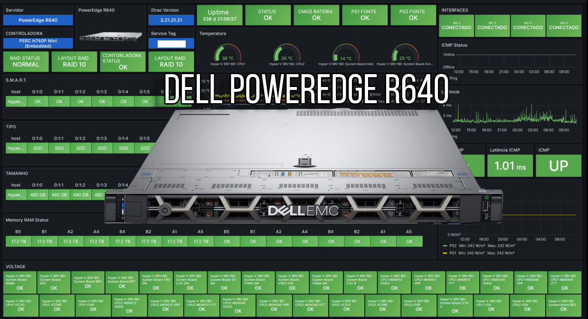
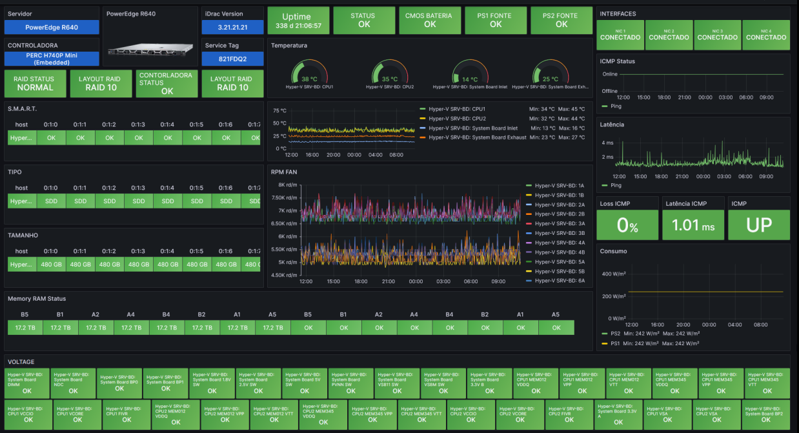

# dashboard_Dell-PowerEdge-R640-iDrac_grafana
Dashboard Grafana Server Dell PowerEdge R640 iDrac

Dell PowerEdge R640 iDrac 

Datasource = Zabbix.

**Métricas:**
Cpu.
Memory
Raid
DISK S.M.A.R.T
Memória RAM Status
ICMP
Consumo Watts
Voltages
Fan
Temperatura
Interfaces
PSU
Uptime
Controladora
CMOS Battery

Grafana Labs = https://grafana.com/orgs/marcusronney
Dúvidas ou sugestões = marcusronney@outlook.com
